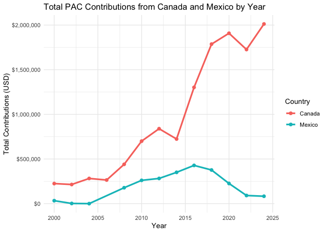
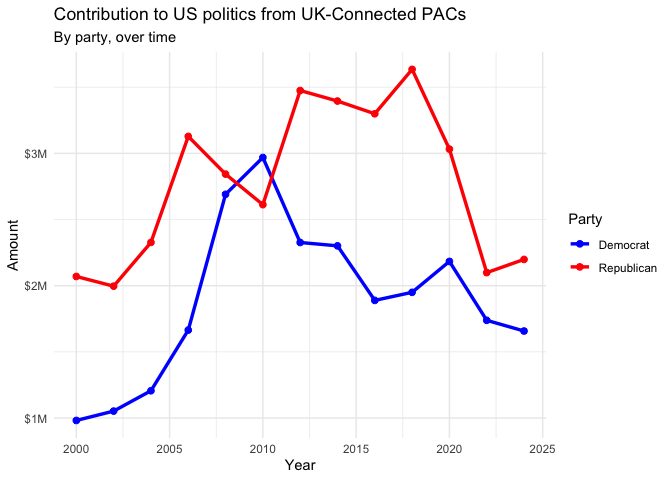

# Optional Lab

Hi Mason, please see my r script in p08.R. There were just a few minor
issues, but otherwise pretty smooth!

Here are my feedbacks:

1.  The instructions on how to scrape the Country of Origin/Parent
    Company are not super clear, because the codes from lab 08 don’t
    entirely work here, I tried multiple times and the country\_parent
    returns as empty (it doesn’t happen to other variables though). My
    guess is that the SelectorGadget did not get me the correct path,
    despite me selecting all the (seemingly) correct elements, so I
    asked GPT and eventually solved it by scraping all the rows and then
    only selecting rows from the 2nd column. Although I am still not
    sure why the old codes didn’t work, I feel like the new codes are
    definitely an interesting alternative to scrape data.

2.  I didn’t use str\_squish as suggested, because I don’t know how
    str\_squish could clean up the data (I know in lab 8 str\_squish was
    used to delete the unnecessary spaces, but there was no extra spaces
    in this data?). I guess instead of just saying “clean it up with
    str\_squish()”, the assignment could ask:

“Some scraped text may contain irregular spacing. Use str\_squish() to
normalize it before analysis. Why might this be helpful?” Or: “After
extracting the Country of Origin/Parent Company, use str\_squish() and
compare it with the raw version. Does anything change? When might
str\_squish() be necessary in web scraping?” These alternative
instructions are provided by GPT!

    pac_all <-read_csv("PAC-all.csv")

    ## Rows: 2641 Columns: 6
    ## ── Column specification ────────────────────────────────────────────────────────
    ## Delimiter: ","
    ## chr (5): PAC_names, Country of Origin/Parent Company, Total, Dems, Repubs
    ## dbl (1): year
    ## 
    ## ℹ Use `spec()` to retrieve the full column specification for this data.
    ## ℹ Specify the column types or set `show_col_types = FALSE` to quiet this message.

## Data Cleaning

pac\_all has 629 observations with 6 variables. Each obs represents one
foreign connected PAC.

    ## separate counrty and parent company in Country of Origin/Parent Company

    pac_all <- pac_all %>%
      separate(
        `Country of Origin/Parent Company`, 
        into = c("country", "parent_company"), 
        sep = "/", 
        fill = "right", 
        extra = "merge"
      ) %>%
      mutate(
        country = str_squish(country),
        parent_company = str_squish(parent_company)
      )

    ## convert $ amount to numeric, getting rid of comma

    pac_all <- pac_all %>%
      mutate(
        Total = str_remove_all(Total, "[$,]") %>% as.numeric(),
        Dems = str_remove_all(Dems, "[$,]") %>% as.numeric(),
        Repubs = str_remove_all(Repubs, "[$,]") %>% as.numeric()
      )

## Data Visualization and Interpretation

#### Create a line plot of total contributions from all foreign-connected PACs in the Canada and Mexico over the years.

From the graph, it seems like that total PAC contributions from Mexico
is pretty stable over years, with a small peak around year of 2016-2017.
Canada, however, have skyrocketed their PAC contributions in the recent
decade. Also the differences in total contribution between Canada and
Mexico seem to be drastic after year of 2010.

    pac_graph <-pac_all %>%
      filter(country %in% c("Canada", "Mexico"))

    ## calculate total contribution of each country by year
    can_mex_summary <- pac_graph %>%
      group_by(year, country) %>%
      summarize(total_contributions = sum(Total, na.rm = TRUE), .groups = "drop")

    can_mex_summary

    ## # A tibble: 25 × 3
    ##     year country total_contributions
    ##    <dbl> <chr>                 <dbl>
    ##  1  2000 Canada               224815
    ##  2  2000 Mexico                33147
    ##  3  2002 Canada               214375
    ##  4  2002 Mexico                 2000
    ##  5  2004 Canada               282025
    ##  6  2004 Mexico                    0
    ##  7  2006 Canada               264512
    ##  8  2008 Canada               440050
    ##  9  2008 Mexico               178100
    ## 10  2010 Canada               699700
    ## # ℹ 15 more rows

    ## graph the total contribution by year (x axis)

    ggplot(can_mex_summary, aes(x = year, y = total_contributions, color = country)) +
      geom_line(size = 1.2) +
      geom_point(size = 2) +
      labs(
        title = "Total PAC Contributions from Canada and Mexico by Year",
        x = "Year",
        y = "Total Contributions (USD)",
        color = "Country"
      ) +
      scale_y_continuous(labels = scales::dollar_format()) +
      theme_minimal()

    ## Warning: Using `size` aesthetic for lines was deprecated in ggplot2 3.4.0.
    ## ℹ Please use `linewidth` instead.
    ## This warning is displayed once every 8 hours.
    ## Call `lifecycle::last_lifecycle_warnings()` to see where this warning was
    ## generated.

#### Recreate the graph

The graph shows that UK-connected PACs have consistently contributed
more to Republican candidates than Democrats over the years. Although
Democratic contributions had a sharp rise around 2010, they have
generally remained lower compared to Republican contributions, which
peaked around 2020 but declined noticeably by 2024.

    pac_uk <-pac_all %>%
      filter(country == "UK")
    ## calculate total contribution of the year by party

    pac_uk_summary <- pac_uk %>%
      group_by(year) %>%
      summarize(
        Democrat = sum(Dems, na.rm = TRUE),
        Republican = sum(Repubs, na.rm = TRUE),
        .groups = "drop"
      )

    ## the graph needs a long format for data, so convert it

    pac_uk_long <- pac_uk_summary %>%
      pivot_longer(
        cols = c(Democrat, Republican),
        names_to = "party",
        values_to = "amount"
      )

    ## recreate the graph

    ggplot(pac_uk_long, aes(x = year, y = amount, color = party)) +
      geom_line(size = 1.2) +
      geom_point(size = 2) +
      labs(
        title = "Contribution to US politics from UK-Connected PACs",
        subtitle = "By party, over time",
        x = "Year",
        y = "Amount",
        color = "Party"
      ) +
      scale_y_continuous(labels = dollar_format(scale = 1e-6, suffix = "M")) +
      scale_x_continuous(limits = c(2000, 2024)) +
      scale_color_manual(values = c("Democrat" = "blue", "Republican" = "red")) +
      theme_minimal()

